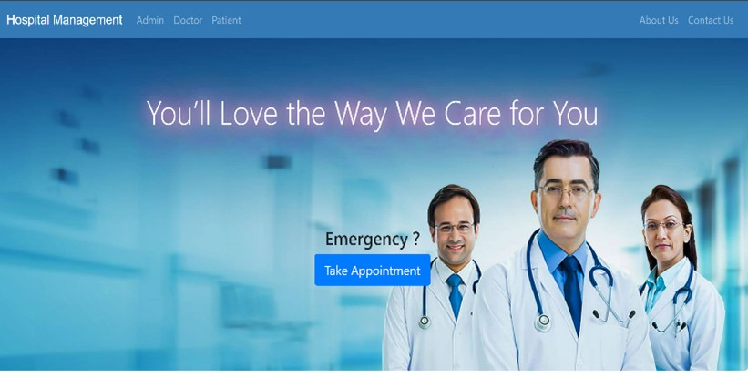

# 🏥 Hospital Management System (HMS)

<div align="center">
  
  <br>
  <em>!Project Preview</em>
</div>

A comprehensive web-based Hospital Management System built using **Django** to streamline and automate the management of hospital operations such as patient records, staff scheduling, inventory tracking, billing, and more.

## 📌 Introduction

The Hospital Management System (HMS) is designed to provide an all-in-one solution for hospital administration and healthcare service optimization. Built on Django, this system offers a modular, scalable, and secure platform suitable for small clinics to large hospitals.

HMS is developed to help:
- **Healthcare professionals** manage patient care and medical histories
- **Administrators** oversee staff, inventory, and finances
- **Hospitals** enhance operational efficiency and patient outcomes

---

## 🎯 Objectives

- ✅ Provide an efficient system for managing **patient records**, appointments, and histories
- ✅ Enable effective **staff scheduling** and duty assignment
- ✅ Implement **billing and accounting** modules with transparency and accuracy
- ✅ Offer **reporting and analytics** to support data-driven decision-making
- ✅ Ensure **seamless integration** across departments and compliance with healthcare regulations

---

## 📦 Features

- **🧑‍⚕️ Patient Management:** Add, view, and manage patient information, appointments, and medical records
- **👨‍⚕️ Staff Scheduling:** Create rosters, assign tasks, and monitor performance
- **📦 Inventory Control:** Track medical supplies, equipment, and pharmaceuticals
- **💳 Billing System:** Generate and manage invoices, payment tracking
- **📈 Reporting Dashboard:** Access analytics and performance reports
- **🔐 Role-Based Access:** Admin, doctor, and staff-level access control
- **🧩 Modular Design:** Scalable for small clinics or large multi-department hospitals

---

## 🛠️ Tech Stack

- **Backend:** Django (Python)
- **Frontend:** HTML, CSS, JavaScript
- **Database:** SQLite (can be configured to PostgreSQL/MySQL)
- **Other:** Bootstrap, Chart.js (for analytics), Django Admin

---

## 🚀 How to Run the Project

1. **Clone the Repository**
   ```bash
   git clone https://github.com/your-username/hospital-management-system.git
   cd hospital-management-system
2. **Create Virtual Environment**
   python -m venv venv
   source venv/bin/activate  # On Windows use venv\Scripts\activate
3. **📥 Install Dependencies**
   ```bash
   pip install -r requirements.txt
4. **Apply Migrations**
   python manage.py makemigrations
   python manage.py migrate
5. **Create Superuser (for admin access)**
   python manage.py createsuperuser
6. **Run the Development Server**
   python manage.py runserver

   


   


